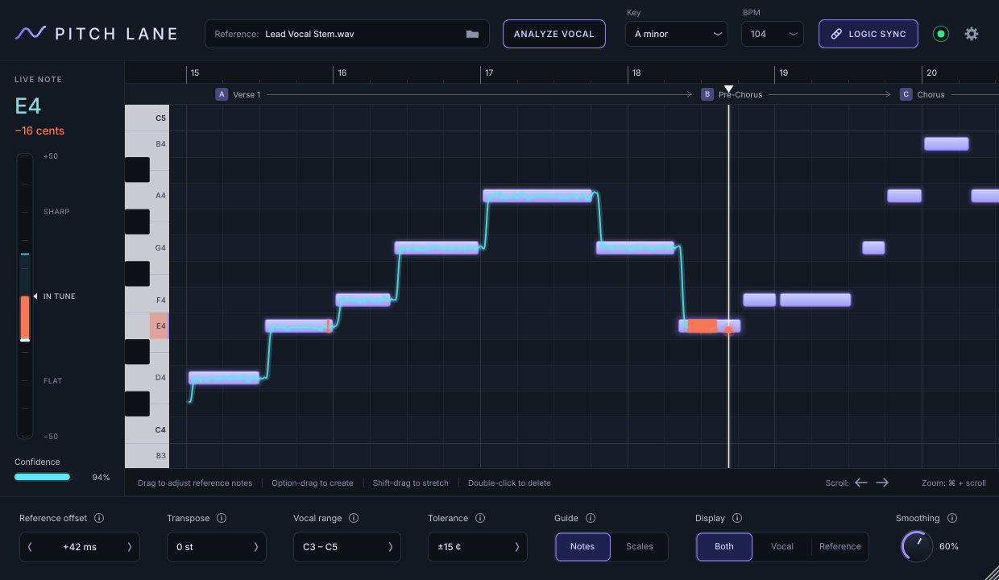

# Pitch Lane

A real-time **singing coach** Audio Unit for **Logic Pro on macOS** (JUCE 8 / C++17).

Insert Pitch Lane on a vocal track. It passes the audio through **bit-identical and unchanged, with zero latency**.
It never tunes or processes the voice. It shows:

- your live sung pitch as a line on a scrolling chromatic piano roll;
- the reference melody as target bars at their pitches and song times;
- while you hold a target note: the **LIVE NOTE** panel with the offset in cents and a SHARP / IN TUNE / FLAT meter
  (in tune = within ±10 cents by default, adjustable), plus the detector's confidence;
- portions of a note sung outside the tolerance turn orange-red on the roll;
- key + scale, a selectable vocal range, bar numbers, and your own section markers (Verse, Chorus, ...).



The layout follows the design mockup in [`docs/design/reference-mockup.png`](docs/design/reference-mockup.png).

The reference melody can come from an **isolated lead-vocal stem** (drop it in, click **Analyze Vocal**, then edit the
notes) or from a **MIDI file** (Import MIDI). Everything, including the notes themselves, is saved in the Logic project.

> **Status (v0.2.0-dev).** Core DSP, analyzer, MIDI, transport and state logic are unit-tested on Linux. The Linux
> Standalone builds. A macOS CI workflow ([`.github/workflows/macos-au.yml`](.github/workflows/macos-au.yml), see
> [`ci/README.md`](ci/README.md)) builds the universal AU on `macos-14` and runs `auval`. The AU has **not yet been tried
> inside Logic Pro**: see [`docs/MAC_VALIDATION.md`](docs/MAC_VALIDATION.md).

---

## Build (macOS, for Logic)

Requirements: macOS 11+, Xcode 14+ command-line tools, CMake ≥ 3.22 (`brew install cmake ninja`).
JUCE 8.0.15 is downloaded automatically by CMake.

```bash
git clone https://github.com/Pak209/pitchlane.git
cd pitchlane
cmake -S . -B build -G Ninja -DCMAKE_BUILD_TYPE=Release -DCMAKE_OSX_ARCHITECTURES="arm64;x86_64"
cmake --build build --target PitchLane_AU PitchLane_Standalone
```

Output: `build/plugin/PitchLane_artefacts/Release/AU/PitchLane.component` (and a Standalone app next to it).
Options: `-DPITCHLANE_VST3=ON` adds VST3. `-DPITCHLANE_COPY_AFTER_BUILD=ON` installs automatically after each build.
`-DPITCHLANE_DISTRIBUTION=ON` is what the release workflow uses: it refuses the copy step, because that step
ad-hoc signs the bundle (the release is signed with Developer ID instead).

### Install

**Easiest: the signed installer.** Download `PitchLane-<version>.pkg` from
[GitHub Releases](https://github.com/Pak209/pitchlane/releases) and double-click it. The package is signed with
Dan Kimoto's Developer ID and notarized by Apple, so Gatekeeper opens it without warnings. It installs
**system-wide**, for every user of the Mac, to

```
/Library/Audio/Plug-Ins/Components/PitchLane.component
```

and therefore **asks for an administrator password**. Restart Logic afterwards; Pitch Lane is under
Audio FX > Audio Units > Pak209 > Pitch Lane. To uninstall, delete that folder
(`sudo rm -rf /Library/Audio/Plug-Ins/Components/PitchLane.component`) and run
`sudo pkgutil --forget com.dkimoto.pitchlane.pkg`. How releases are built: [docs/RELEASING.md](docs/RELEASING.md).

**Fallback: manual install for your user only** (no admin password, e.g. for your own builds or CI artifacts).
Don't keep both copies: if you switch to the pkg, delete the `~/Library` one. The exact install path is:

```
~/Library/Audio/Plug-Ins/Components/PitchLane.component
```

```bash
mkdir -p ~/Library/Audio/Plug-Ins/Components
cp -R build/plugin/PitchLane_artefacts/Release/AU/PitchLane.component ~/Library/Audio/Plug-Ins/Components/
codesign --force --deep -s - ~/Library/Audio/Plug-Ins/Components/PitchLane.component   # ad-hoc sign
killall -9 AudioComponentRegistrar 2>/dev/null || true                                   # refresh the AU cache
auval -v aufx Plne Pk20                                                                    # should end in "AU VALIDATION SUCCEEDED"
```

**Using the CI build instead** ([`.github/workflows/macos-au.yml`](ci/README.md): Actions > *macOS AU* > artifact `PitchLane-AU-macOS-universal`): unzip it, copy
`PitchLane.component` to the path above, then remove the download quarantine and ad-hoc sign it (the build is
unsigned):

```bash
xattr -dr com.apple.quarantine ~/Library/Audio/Plug-Ins/Components/PitchLane.component
codesign --force --deep -s - ~/Library/Audio/Plug-Ins/Components/PitchLane.component
killall -9 AudioComponentRegistrar 2>/dev/null || true
```

The build is universal (Apple Silicon + Intel).

### If Logic doesn't show it / validation failed

1. **Logic Pro > Settings > Plug-in Manager.** Find **Pitch Lane** under the manufacturer **Pak209**.
2. Select it and click **Reset & Rescan Selection**. Make sure the **Use** checkbox is enabled.
3. Still failing: quit Logic, then in Terminal:
   ```bash
   killall -9 AudioComponentRegistrar
   auval -a | grep -i Plne          # is it registered at all?  expect: aufx Plne Pk20 - Pak209: Pitch Lane
   auval -v aufx Plne Pk20          # full validation log
   ```
4. Downloaded build: run the `xattr -dr com.apple.quarantine …` and `codesign --force --deep -s - …` commands
   above, then rescan.

In Logic the plug-in is under **Audio FX > Audio Units > Pak209 > Pitch Lane**.

---

## Using it

**Header.**

| Control | What it does |
|---|---|
| **Reference:** field / folder | Choose the isolated lead-vocal stem (or drag an audio / MIDI file onto the window). Orange "(missing)" = the file moved; the notes are saved in the project and still work. |
| **ANALYZE VOCAL** | Turns the stem into editable reference notes in the background. While it runs the button shows **CANCEL nn%** and a progress card sits in the middle of the roll. When it finishes, the hint bar says what it found (e.g. "153 notes found (29 muted as harmony) · showing bar 9"), the roll jumps to the first sung note (about 8 bars) and the pitch window covers the melody. If the vocal range is still the default C3–C5 it is widened to fit the notes; a range you set yourself is kept and an **Expand range to …** button is offered instead. No notes / a file that can't be read gives a red message in the hint bar and on the roll. |
| **Key** | Key and scale (e.g. "A minor"): used by the *Scales* guide and the row shading. |
| **BPM** | Shows Logic's tempo while *Logic Sync* is on. With sync off (or no host tempo) it is the manual tempo: drag, scroll, pick from the menu or double-click to type. Its menu also sets the manual **time signature** (2/4 … 12/8). |
| **LOGIC SYNC** | On (default): follow Logic's transport, position and tempo. Off: ignore the host and run a free clock at the manual BPM. |
| Status dot | **Green** = Logic playing (synced). **Amber** = Logic stopped (synced; live pitch is compared with the note under Logic's playhead). **Grey** = no transport info from Logic: Logic only runs a plug-in while it plays or while its track is selected / record-armed, so a stopped, unselected track sends nothing (the BPM then shows the manual tempo until you press play). Hollow grey = Logic Sync off. Hover for details. |
| ⚙ Settings | Note names (Middle C = C4 / C3 as in Logic), timing calibration, **timing tolerance** (on-time window, default ±80 ms), input gate, clarity, visible time, follow playhead, Import / Export MIDI, **Mute / Unmute harmonies**, **Remove muted**, Undo / Redo, Select all, edit buttons for the selection (Delete, Mute, ±1 st, ±10 ms), Clear notes, section markers, Clear trace, Restart clock. |

**Bottom bar** (each title has an ⓘ tooltip): **Reference offset** (ms, moves the reference notes against the song; arrows
10 ms, Shift 1 ms), **Transpose** (st), **Vocal range** (voice-type presets or lowest / highest note), **Tolerance** (±cents),
**Guide** (*Notes* = compare with the reference melody, *Scales* = compare with the nearest note of the key / scale),
**Display** (*Both* / *Vocal* line only / *Reference* notes only), **Smoothing** (0–100 %, how much the live line is
smoothed; 60 % is the original tuning, 0 % is the raw detector output). Every value field also takes vertical drag, the
mouse wheel and double-click-to-type.

**Roll.** Bar numbers along the top (following Logic's tempo and time-signature changes), the section-marker lane, the keyboard
(the target note is marked lavender, the sung note tinted), reference notes as lavender bars, and your live line in
cyan. Where you are outside the tolerance on a note, the line and that part of the note turn orange-red (the first
100 ms of each note are not judged, so scoops into a note aren't flagged). The loop region is shaded when Logic's
Cycle is on. The view follows the playhead while playing and zooms vertically to the current phrase inside the vocal
range. **Go to notes** (hint bar, or click the "notes outside this view" card) scrolls and zooms to the first reference
note. Reference notes sit at *file time + Reference offset* on Logic's timeline, so a stem that starts at Logic's
project start lines up with offset 0; if the region starts later, set the offset to that position.
Rows in the key are shaded faintly in *Notes* mode and strongly in *Scales* mode.

**Take feedback.** After each reference note, a tick marks where you came in: **green** = on time (within the timing
tolerance), **amber** = early, **orange** = late, with the offset in ms. A dashed outline marks a missed note, and an
arrow at the end marks a note that drifted up or down. The left panel shows the last note (e.g. "Late +80 ms · 12¢
sharp") and the take so far ("Take: 9/12 on time · 2 late · 1 missed"). A new take starts whenever you seek, the cycle
wraps or playback starts.

**Harmonies.** Grey notes are muted: they are not judged, not used for the live target and not exported. Analyze Vocal
mutes notes it thinks belong to a harmony or backing line (amber outline). Importing a MIDI part with chords or
harmonies asks whether to keep the lead only (top voice, or loudest / longest notes) or all voices with the harmonies
muted. Mute / unmute selected notes with **M** or the right-click menu. *Mute harmonies* and *Remove muted* are in the
right-click menu and in Settings.

**Editing** (as labelled in the hint bar under the roll):
- **Drag** a note to move it in time and pitch (all selected notes move together).
- **Option-drag** to create a note (Option-click creates a one-beat note).
- **Shift-drag** a note to stretch it (dragging a note's right edge does the same).
- **Double-click** a note to delete it.
- Click selects, ⌘-click adds/removes, drag in empty space rubber-band selects (Shift/⌘ adds). When notes are selected,
  the hint bar shows **−1 st / +1 st / ◀ 10 ms / 10 ms ▶ / Delete** buttons (Logic may swallow keys).
- **Scroll ← →** buttons or the mouse wheel scroll time, **⌘ + scroll** zooms, Shift + vertical scroll moves the pitch
  window, dragging the bar ruler (or middle-drag) pans.
- Keys, if Logic passes them through: Delete/Backspace, ↑/↓ (Shift = octave), ←/→ (Shift = 100 ms), ⌘A, ⌘Z / ⇧⌘Z, Esc.

**Section markers.** An Audio Unit can't read Logic's arrangement markers, so Pitch Lane has its own: double-click the
lane under the bar numbers to add one (or Settings > *Add at playhead*), type its name, drag it to move it, double-click
to rename, right-click for Rename / Delete. They are lettered A, B, C... in song order and saved in the project. There
are no built-in sections.

Notes, markers and settings are stored **inside the Logic project**.

Colours: **cyan** = in tune (or no target at that moment), **orange-red** = outside the tolerance, **lavender** = reference notes, **grey** = muted notes.

**Audio formats for Analyze Vocal:** WAV, AIFF, FLAC, Ogg and MP3, plus M4A (AAC / Apple Lossless) and CAF on macOS
through Core Audio. Stereo files are mixed to mono. Any sample rate works. Files up to 20 minutes.

### Diagnostics log

Pitch Lane writes a small log to **`~/Library/Logs/PitchLane/pitchlane.log`** (open it with Console.app, or
`open ~/Library/Logs/PitchLane/`): plug-in version and build, host, when a vocal is loaded, decode / analysis timings,
note counts, where the view was fitted, the transport state and any error. It rotates at about 1 MB and holds no
audio. Please attach it when reporting a problem.

---

## Test procedure for Twin (about 10 minutes)

1. Open a Logic project with a vocal track. On the track's **Audio FX** slot choose **Audio Units > Pak209 > Pitch Lane**.
   The sound must be exactly the same as without it.
2. Record-enable the track with input monitoring on (or play back a recorded vocal). **Sing an A** (the A above middle C,
   A4) and hold it: LIVE NOTE should say **A4, close to 0 cents** once a reference note is under the playhead (without
   one it shows the nearest note). (Set *Note names* to "Middle C = C3" in ⚙ Settings if you prefer Logic's naming. It will then read A3.)
3. ⚙ Settings > **Import MIDI…** and choose a MIDI file of the melody (in Logic: select the melody region > File > Export >
   Selection as MIDI File). Bars appear on the roll.
4. **Play** from the start, then **seek** to the middle, then turn on **Cycle** over 2 bars. The target bars should
   stay locked to Logic's playhead, and each loop pass redraws your line. If the bars are offset from the song, adjust
   **Reference offset**. The status dot should be green, the BPM should show Logic's tempo and the bar numbers should match Logic's.
5. Sing along: the cents readout and meter follow you, your line is cyan when in tune and orange-red (on the note too)
   when outside the tolerance.
6. Click the **Reference** field, pick an isolated lead-vocal stem, click **ANALYZE VOCAL** (it shows CANCEL nn%; try
   cancelling once and then run it again). Notes appear as bars.
7. Find a **bad note** (for example a short blip from reverb or a harmony) and double-click it to delete it. Option-drag
   to draw a note, Shift-drag to stretch one, drag another slightly, then ⚙ > **Undo**.
   Double-click the lane under the bar numbers to add a section marker and name it.
8. **Save** the project, close it, reopen it: the notes, section markers and settings are still there. Optionally rename
   the stem file and reopen: the Reference field shows the name in orange with "(missing)" (the notes still work).

Report back: macOS version, Logic version, Apple Silicon or Intel, and anything in `docs/MAC_VALIDATION.md` that
didn't behave.

---

## Development

```bash
# Core library + tests only (no JUCE, any OS):
cmake -S . -B build-core -G Ninja -DPITCHLANE_BUILD_PLUGIN=OFF && cmake --build build-core && ctest --test-dir build-core
# Everything (Linux needs: libasound2-dev libfreetype-dev libfontconfig1-dev libx11-dev libxrandr-dev
#   libxinerama-dev libxcursor-dev libxcomposite-dev libxext-dev libgl1-mesa-dev):
cmake -S . -B build -G Ninja -DCMAKE_BUILD_TYPE=Release && cmake --build build && ctest --test-dir build
# Headless UI screenshot with test data (synthetic melody + synthesised voice):
cmake --build build --target PitchLaneSnapshot
xvfb-run -a build/plugin/PitchLaneSnapshot_artefacts/Release/PitchLaneSnapshot ui.png [width height]
```

Docs: [`docs/ARCHITECTURE.md`](docs/ARCHITECTURE.md) · [`docs/MAC_VALIDATION.md`](docs/MAC_VALIDATION.md) ·
[`docs/LICENSES.md`](docs/LICENSES.md) · [`docs/BASIC_PITCH.md`](docs/BASIC_PITCH.md)

## License

Pitch Lane is licensed under the **GNU Affero General Public License v3.0** (see `LICENSE`).

Why AGPLv3: Pitch Lane is built on [JUCE 8](https://juce.com), which is dual-licensed under AGPLv3 or a commercial
JUCE licence. This project uses JUCE under its AGPLv3 option, so the plugin as a whole must be distributed under
AGPLv3-compatible terms with its full source available, which is what this public repo does. Personal use (building
it and using it in your own Logic projects) is unrestricted. Distributing Pitch Lane as closed source would require a
commercial JUCE licence first. Details: [`docs/LICENSES.md`](docs/LICENSES.md).
